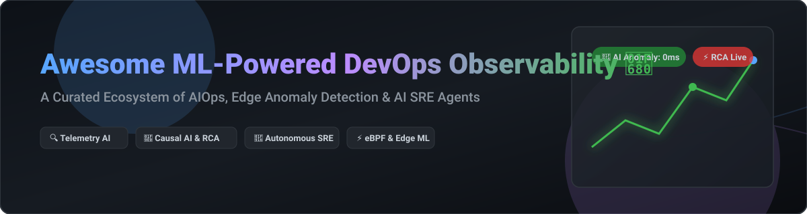

# Awesome ML-Powered DevOps & Observability Ecosystem 🚀

  

  
  
  
  
  

## 📌 Overview & Ecosystem Architecture

Welcome to the ultimate curated directory of **ML-Powered DevOps, AIOps, Edge Anomaly Detection, and AI SRE Agent tools**. As cloud-native architectures become increasingly complex, modern engineering teams rely on Machine Learning and Large Language Models (LLMs) to automatically detect telemetry anomalies, reduce alert fatigue, infer causal topology, and automate root cause analysis (RCA).

---

## 📈 Market Size & Industry Dynamics

> 💡 **Market Insights**: The global AIOps and ML-powered Observability market is estimated at **~$18.5 Billion in 2026** and is projected to expand to **$42+ Billion by 2030** (CAGR ~22.5%). 
> 
> 🧩 **Market Fragmentation**: The market is **moderately fragmented**. Established enterprise observability giants (Amazon Web Services, Splunk/Cisco, Datadog, Dynatrace) control significant market share in enterprise log/trace aggregation. However, rapid innovation around **eBPF-driven telemetry**, **open-source AI SRE agents (CNCF/HolmesGPT)**, and **Model Context Protocol (MCP) integrations** is preventing a single "winner-take-all" outcome, allowing high-growth startups and open-source projects to capture specialized domain market share.

---

## 📑 Table of Contents
- [📌 Overview \& Ecosystem Architecture](#-overview--ecosystem-architecture)
- [📈 Market Size \& Industry Dynamics](#-market-size--industry-dynamics)
- [🏢 SaaS \& Hosted Commercial Platforms](#-saas--hosted-commercial-platforms)
- [⚡ Open-Source GitHub Projects](#-open-source-github-projects)
  - [Zero-Instrumentation \& Edge ML Observability](#zero-instrumentation--edge-ml-observability)
  - [AI SRE Agents, MCP \& Autonomous Incident Response](#ai-sre-agents-mcp--autonomous-incident-response)
  - [Distributed Tracing, APM \& Metrics Engine](#distributed-tracing-apm--metrics-engine)
- [🤝 How to Contribute](#-how-to-contribute)
- [💖 Support \& Community](#-support--community)
- [⚠️ Disclaimer \& Security Practices](#️-disclaimer--security-practices)
- [⭐ Star History](#-star-history)

---

## 🏢 SaaS & Hosted Commercial Platforms

The table below lists top commercial ML-powered observability and AIOps platforms, ranked by company size (Annual Revenue / Market Capitalization / Valuation, descending).

| SaaS Platform 🛠️ | Company Size / Revenue 💰 | Starting Pricing 💵 | Free Tier / Trial Limit 🎁 | Core ML / AI Observability Features 🧠 |
| :--- | :--- | :--- | :--- | :--- |
| **[Amazon DevOps Guru](https://aws.amazon.com/devops-guru/)** | ~$600B+ (AWS division revenue) / ~$2.2T Market Cap | $0.0028 per DevOps Guru resource-hour | 14-day free trial (up to 7,200 resource hours/month) | AWS ML operational anomaly detection, proactive insights, log enrichment & remediation recommendations. |
| **[Splunk ITSI](https://www.splunk.com/)** | ~$28B (Acquired by Cisco) | ~$1,800/year (Splunk Enterprise Cloud per-workload unit) | 14-day free trial (50 GB/day ingestion limit) | IT Service Intelligence, ML-powered KPI tracking, predictive outage detection & anomaly correlation. |
| **[Datadog Watchdog & Bits AI](https://www.datadoghq.com/product/platform/watchdog/)** | ~$35B Market Cap (~$2.6B ARR) | $15/host/month (Pro Tier) | 14-day full-featured free trial (unlimited hosts during trial) | Automated anomaly detection, Bits AI natural-language triage, latency root-cause detection & outlier analysis. |
| **[Dynatrace Davis AI](https://www.dynatrace.com/platform/artificial-intelligence/)** | ~$15B Market Cap (~$1.5B ARR) | $0.08/hour per 8 GiB host ($58/month) | 15-day full-featured free trial (no credit card required) | Deterministic causal AI, automatic dependency topology mapping, baseline seasonality & Davis CoPilot natural language triage. |
| **[New Relic AI (Applied Intelligence & Lookout)](https://newrelic.com/platform/ai)** | ~$6.5B Valuation (~$1.0B ARR) | $49/user/month (Core User) + $0.30/GB above 100 GB | 100 GB/month perpetual free data ingestion + 1 free full-platform user | Platform-wide AI without separate SKUs, Applied Intelligence alert noise reduction & Lookout entity anomaly detection. |
| **[PagerDuty AIOps](https://www.pagerduty.com/platform/aiops/)** | ~$2.2B Market Cap (~$460M ARR) | $21/user/month (Professional Plan) | 14-day free trial (Professional tier features) | ML alert grouping, intelligent noise reduction, past incident correlation & automated remediation triggers. |
| **[ScienceLogic AI Platform](https://sciencelogic.com/)** | ~$1.2B Valuation (~$200M ARR) | ~$3.50/device/month (Base Enterprise tier) | 30-day interactive free trial / demo environment | Hybrid cloud discovery, automated event correlation, causal root-cause analysis & service graph mapping. |
| **[BigPanda](https://www.bigpanda.io/)** | ~$1.2B Valuation (~$80M ARR) | ~$25,000/year base platform package | 30-day enterprise sandbox trial | Open AIOps alert deduplication, Open AI-powered event correlation & incident payload enrichment. |
| **[Moogsoft](https://www.moogsoft.com/)** | ~$500M (Acquired by Dell Tech) | ~$833/month (Express Tier) | 14-day free trial (up to 1,000 events/minute) | Algorithmic noise reduction, adaptive alert clustering, situation workflow automation & early incident warnings. |

---

## ⚡ Open-Source GitHub Projects

The open-source ML observability ecosystem is categorized below and sorted strictly by **GitHub Star Count (descending)**. Each badge links directly to the repository's stargazers page.

### Zero-Instrumentation & Edge ML Observability

- **[Netdata](https://github.com/netdata/netdata)**   
  **18 unsupervised ML models running on the edge agent per metric dimension with consensus voting**. Suppresses false positives at the source with sub-second detection latency. Features Anomaly Advisor, Blast Radius detection, and MCP-native AI Co-Engineer integrations.

- **[Keep](https://github.com/KeepHQ/keep)**   
  **Open-source AIOps and alert management platform**. Connects to all your monitoring tools (Prometheus, Datadog, Grafana) to deduplicate, enrich, and correlate alerts with AI workflows.

- **[Coroot](https://github.com/coroot/coroot)**   
  **Zero-instrumentation eBPF full-stack observability with AI-powered root cause analysis**. Automatically traces microservice dependencies, maps 100% of network topology, tracks deployment releases, and surfaces instant RCA suggestions.

---

### AI SRE Agents, MCP & Autonomous Incident Response

- **[Robusta](https://github.com/robusta-dev/robusta)**   
  **Kubernetes-native AIOps engine and incident response platform**. Automated playbooks triggered by Prometheus alerts with Slack, Teams, and web UI alert correlation.

- **[HolmesGPT](https://github.com/robusta-dev/holmesgpt)**   
  **CNCF Sandbox AI SRE Agent for incident investigation across any cloud stack**. Features 24/7 Operator Mode, bi-directional AlertManager / PagerDuty / OpsGenie integrations, and supports OpenAI, Anthropic, Gemini, or Bedrock LLMs.

- **[KubeIntellect](https://zenodo.org/records/22729414)**  
  **LLM-orchestrated multi-agent framework for autonomous Kubernetes operations**. Natural-language root-cause analysis across `kubectl`, Prometheus, and Loki with human-in-the-loop safety gating.

- **[observability-mcp](https://github.com/ThoTischner/observability-mcp)**   
  **MCP-native observability server with topology-aware reasoning**. Delivers Streamable HTTP transport, `get_topology` / `get_blast_radius` tools, local LLM support via Ollama, and reproducible in-tree RCA benchmarks.

---

### Distributed Tracing, APM & Metrics Engine

- **[Prometheus](https://github.com/prometheus/prometheus)**   
  **The CNCF cloud-native monitoring system and time-series database**. Serves as the primary telemetry substrate for open-source ML anomaly detection models and AIOps engines.

- **[SigNoz](https://github.com/signoz/signoz)**   
  **Open-source APM & full-stack observability platform**. Native OpenTelemetry backend for logs, traces, and metrics with anomaly detection query capabilities.

- **[Apache SkyWalking](https://github.com/apache/skywalking)**   
  **Distributed tracing, metrics aggregation, and APM for microservices**. Includes **AI Sessionizer** for long-lived LLM agent conversation tracing and an integrated SkyWalking MCP Server.

- **[Jaeger](https://github.com/jaegertracing/jaeger)**   
  **CNCF end-to-end distributed tracing platform**. Monitors complex microservice interactions for latency distribution anomalies.

- **[OpenObserve](https://github.com/openobserve/openobserve)**   
  **High-performance cloud-native observability platform for logs, metrics, traces, and RUM**. Built with Rust for lightweight telemetry stream analysis.

- **[Pyroscope](https://github.com/grafana/pyroscope)**   
  **Continuous profiling platform**. Uses profiling data to pinpoint CPU / Memory bottlenecks and detect continuous runtime regressions.

- **[OpenTelemetry Collector](https://github.com/open-telemetry/opentelemetry-collector)**   
  **Vendor-neutral telemetry proxy**. Receives, processes, and exports telemetry data to downstream AIOps engines and ML pipelines.

- **[Grafana Tempo](https://github.com/grafana/tempo)**   
  **High-scale distributed tracing backend**. Deeply integrated with Grafana ML outlier detection and adaptive metrics baselining.

- **[Perses](https://github.com/perses/perses)**   
  **CNCF sandbox developer-friendly dashboard and visualization tool**. Designed as an open standard alternative to proprietary visualization tools.

---

## 🤝 How to Contribute

Contributions are warmly welcomed! Help keep this directory comprehensive and up to date:

1. **Fork** the repository.
2. Edit `README.md` following the table / list schema.
3. Ensure entries include exact project name, link, concise feature summary, pricing details (for SaaS), or GitHub star badges (for OSS).
4. Submit a **Pull Request** with a clear title and description.

---

## 💖 Support & Community

If you find this repository helpful, please consider supporting the project:

- ⭐️ **Star** this repository on GitHub to increase visibility!
- 🔀 **Fork** and share it with your DevOps, SRE, and Cloud Infrastructure colleagues.
- ☕ **Sponsor / Buy me a Coffee**: If you'd like to support ongoing maintenance and research, visit the [GitHub Sponsor Dashboard](https://github.com/sponsors/ishandutta2007)! Thank you for your support!

---

## ⚠️ Disclaimer & Security Practices

- This list is **community-curated** for research purposes and does not constitute an endorsement.
- **Data Privacy**: Telemetry processed by ML models often contains sensitive PII, logs, or infrastructure topologies. Ensure strict encryption and compliance.
- **False Positives**: Unsupervised ML models can trigger false positives; use consensus voting or threshold tuning to minimize noise.
- **RBAC**: AI SRE Agents (e.g., HolmesGPT, observability-mcp) require read access to cluster logs and metrics. Apply least-privilege RBAC policies.

---

## ⭐ Star History

---

  <b>Made with ❤️ for SREs, DevOps Engineers, and Cloud Architects.</b>

